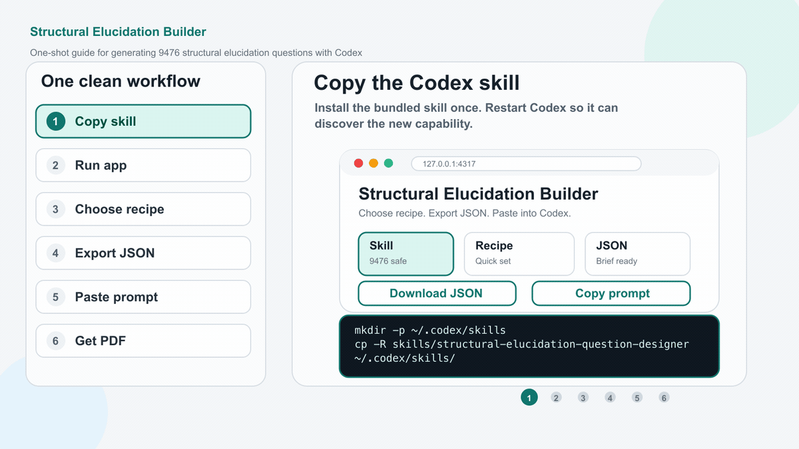

# Structural Elucidation Builder

<p align="center">
  
</p>

<p align="center">
  <a href="assets/structural-elucidation-builder-guide.mp4">Download the MP4 guide</a>
</p>

This repo contains:

- a Codex skill for generating 9476-aligned structural elucidation questions
- a simple local app that helps you choose chapters/tests and export a JSON brief
- a compact, non-verbatim 9476 boundary checklist for grounding the skill

## 1. Copy the skill into Codex

Copy this folder:

```text
skills/structural-elucidation-question-designer
```

into your Codex skills folder:

```text
~/.codex/skills/structural-elucidation-question-designer
```

On macOS, from this repo:

```bash
mkdir -p ~/.codex/skills
cp -R skills/structural-elucidation-question-designer ~/.codex/skills/
```

Restart Codex after copying the skill.

## 2. Open the JSON builder app

From this repo:

```bash
cd app
npm start
```

Open:

```text
http://127.0.0.1:4317
```

## 3. Generate a JSON brief

In the app:

1. Choose a ready recipe.
2. Adjust chapters, tests or reasoning skills if needed.
3. Click **Download JSON** or **Copy Codex prompt**.

The app only shows 9476-safe options.

The skill grounds its chemistry using the compact checklist:

```text
skills/structural-elucidation-question-designer/references/9476-boundaries.md
```

If you have the right to keep a local copy of the official syllabus, you may add a local-only extract here:

```text
skills/structural-elucidation-question-designer/references/syllabus/9476-organic-chemistry-extract.md
```

## 4. Paste into Codex

Paste the generated Codex prompt into Codex.

It will start with:

```text
Use $structural-elucidation-question-designer to generate a structural elucidation worksheet from this JSON brief.
```

Codex should then:

1. use the skill,
2. stay within H2 Chemistry 9476,
3. generate structures from SMILES,
4. render black skeletal diagrams,
5. create student questions,
6. create answer keys in clue/deduction table format,
7. check formulae and chemistry.

## 5. What to ask Codex

Example:

```text
Use $structural-elucidation-question-designer to generate the worksheet from this JSON brief.
Make it a PDF.
Use black generated structures.
Answers must use clue/deduction tables.
Check all formulae and products.

<paste the JSON brief here>
```

## 6. Output

Ask Codex for one of these:

- `PDF worksheet with answers`
- `Markdown worksheet with answers`
- `questions only`
- `answer key only`

For the best result, ask for:

```text
PDF worksheet with student questions, generated skeletal structures, and answer keys in clue/deduction tables.
```

## 7. Regenerate the README guide

The README guide is generated from code.

Requirements:

- Node.js
- FFmpeg

Then run:

```bash
npm install
npm run generate-demo
```

This regenerates:

- `assets/structural-elucidation-builder-guide.gif`
- `assets/structural-elucidation-builder-guide.mp4`

## 8. Check syllabus grounding

Run:

```bash
npm run check-syllabus
```

This verifies that the skill points to the compact 9476 boundary checklist, and also checks an optional local syllabus extract if you have added one.
