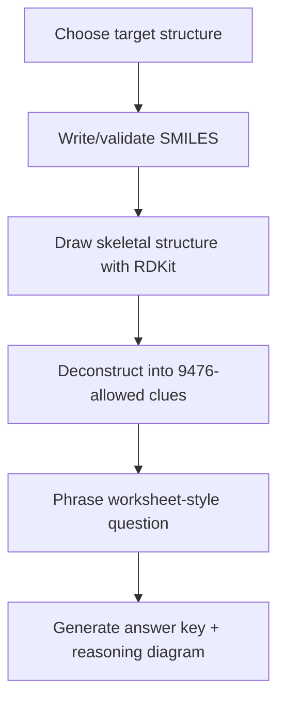
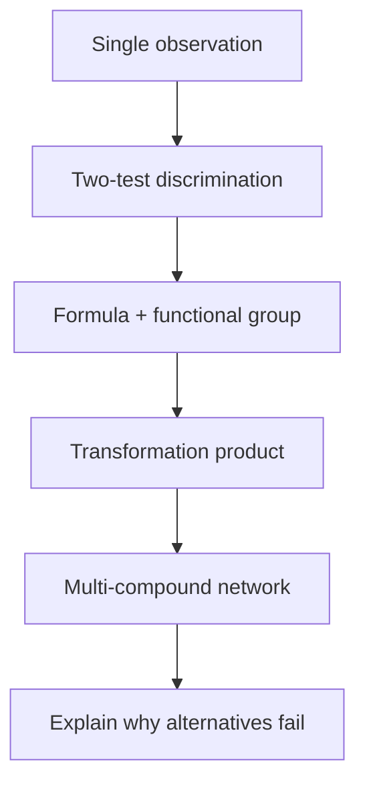

# Structural Elucidation Question Designer

Create 9476-aligned structural elucidation questions by starting from the answer structure, validating/drawing it from SMILES, then deconstructing it into allowed observations and reactions.

## Core Workflow

1. Confirm the question is within H2 Chemistry 9476 organic chemistry boundaries.
   - Read `references/9476-boundaries.md` when deciding allowed chemistry.
2. Choose the target structure or reaction network first.
3. Write SMILES for every target/product/intermediate structure that needs a diagram.
4. Validate and draw structures with RDKit.
   - Use `scripts/render_structures.py` for a CSV of compounds.
   - Use `scripts/build_worksheet.py` when generating a complete Markdown worksheet from JSON.
5. Deconstruct each target into 4-6 useful clues:
   - molecular formula clue
   - positive functional-group test
   - negative exclusion test
   - transformation/product clue
   - isomerism clue if useful
6. Phrase questions in the extracted worksheet style:
   - "Compound A, CxHyOz, is neutral."
   - "A shows the following properties or reactions."
   - "State what can be deduced from each statement."
   - "Suggest the structural formulae of A, B and C."
   - "Explain the chemistry involved."
   - "Draw the structural formulae of compounds A to D."
7. Write the answer key as observation -> deduction -> structure.
8. Check the final question:
   - all chemistry is 9476-allowed
   - all SMILES parse in RDKit
   - formulae match question text
   - the intended answer is unique unless the question asks for possible structures

## Structure Drawing

Use RDKit-generated diagrams, not hand-drawn Mermaid chemical structures. Mermaid is only for reasoning maps.

CSV renderer:

```bash
python3 /Users/etdadmin/.codex/skills/structural-elucidation-question-designer/scripts/render_structures.py \
  --input compounds.csv \
  --out-dir ./structural-elucidation-output
```

Expected CSV:

```csv
question_id,compound_label,name,smiles,role,notes
q001,A,butan-2-one,CCC(C)=O,target,
q001,B,ethanoic acid,CC(=O)O,product,
```

The renderer writes:

- `structures/<question_id>_<compound_label>.svg`
- `structures/<question_id>_<compound_label>.png`
- `structures/manifest.tsv`
- `structures/manifest.json`

Complete worksheet builder:

```bash
python3 /Users/etdadmin/.codex/skills/structural-elucidation-question-designer/scripts/build_worksheet.py \
  --input question_set.json \
  --out-dir ./structural-elucidation-output
```

Read `references/input-schema.md` before preparing JSON input.

## Question Design Pattern

Use this construction path:



Skill-building progression:



Question families to support:

- carbonyl classifier
- alcohol oxidation and iodoform
- phenol vs alcohol
- carboxylic acid vs ester
- halogenoalkane substitution/elimination
- alkene oxidative cleavage
- aromatic side-chain oxidation
- amide/nitrile hydrolysis
- chirality and cis-trans isomerism

## Dependency Fallback

If RDKit is unavailable, create a local Python 3.11/3.12 virtual environment and install:

```bash
python3.11 -m venv .venv-rdkit
.venv-rdkit/bin/pip install rdkit-pypi "numpy<2" Pillow
```

Then run scripts with `.venv-rdkit/bin/python`.
